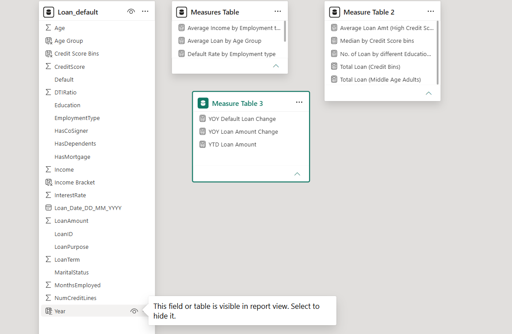
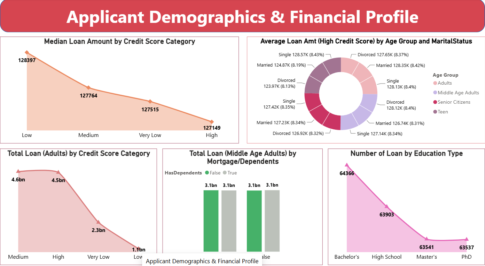
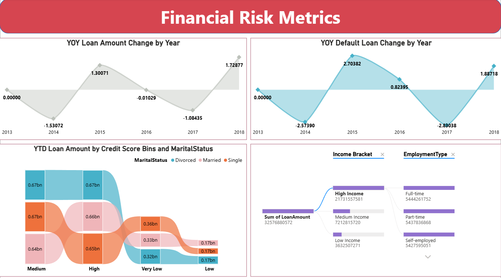
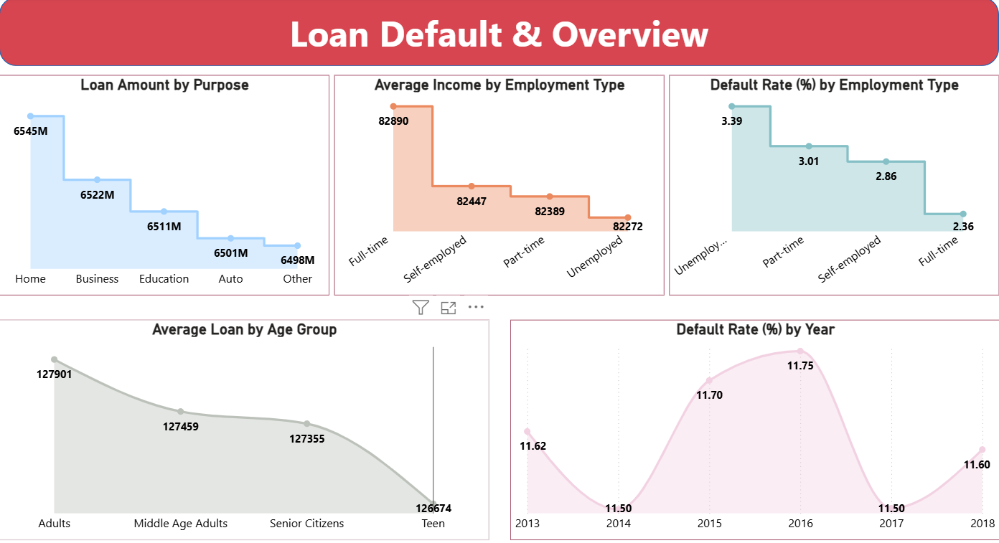

# 💳 Loan Default Analysis — Power BI

## 📌 Project Overview

**Loan Default Analysis** is a Power BI project focused on analyzing applicant demographics, loan characteristics, financial risk, and default patterns.

The project combines:

**Power BI Dataflow Gen1 → Incremental Refresh → Scheduled Refresh → Data Modeling → DAX → Interactive Financial Analysis**

The report contains three analytical pages covering applicant demographics, financial risk metrics, and overall loan/default performance.

---

## 🎯 Project Objectives

- Analyze loan amounts across different **credit score categories**.
- Understand loan patterns across **age groups, marital status, education, and employment type**.
- Analyze **default rates** by employment type and year.
- Track **year-over-year changes** in loan amount and default loans.
- Perform **YTD loan analysis**.
- Compare loan amounts across **credit score bins** and applicant characteristics.
- Build an interactive Power BI report using reusable DAX measures.

---

# 🔄 Data & Refresh Architecture

A **Power BI Dataflow Gen1** was created for this project and used as the data source for the report.

The project also includes:

- **Incremental Refresh**
- **Scheduled Refresh**
- Power BI data modeling and DAX-based analysis

### Data Flow

```text
Source Data
     ↓
Power BI Dataflow Gen1
     ↓
Incremental Refresh
     ↓
Scheduled Refresh
     ↓
Power BI Dataset / Model
     ↓
Loan Default Analysis Report
```

This setup demonstrates a reporting workflow that goes beyond a manually refreshed Power BI Desktop file.

---

# 🧩 Data Model

The main dataset is the **`Loan_default`** table.

Three dedicated measure tables were created to organize measures according to the report pages:

| Measure Table | Report Page |
|---|---|
| **Measures Table** | Loan Default & Overview |
| **Measure Table 2** | Applicant Demographics & Financial Profile |
| **Measure Table 3** | Financial Risk Metrics |

This structure keeps the model organized and separates measures based on their analytical purpose.




---

# 🧮 DAX Calculated Columns

Several calculated columns were created using DAX to prepare the data for analysis.

## Age Group

```DAX
Age Group =
IF(
    'Loan_default'[Age] <= 19,
    "Teen",
    IF(
        'Loan_default'[Age] <= 39,
        "Adults",
        IF(
            'Loan_default'[Age] <= 59,
            "Middle Age Adults",
            "Senior Citizens"
        )
    )
)
```

### Categories

| Age | Category |
|---:|---|
| ≤ 19 | Teen |
| 20–39 | Adults |
| 40–59 | Middle Age Adults |
| > 59 | Senior Citizens |

---

## Credit Score Bins

```DAX
Credit Score Bins =
IF(
    'Loan_default'[CreditScore] <= 400,
    "Very Low",
    IF(
        'Loan_default'[CreditScore] <= 450,
        "Low",
        IF(
            'Loan_default'[CreditScore] <= 650,
            "Medium",
            "High"
        )
    )
)
```

### Categories

| Credit Score | Category |
|---:|---|
| ≤ 400 | Very Low |
| 401–450 | Low |
| 451–650 | Medium |
| > 650 | High |

---

## Income Bracket

```DAX
Income Bracket =
SWITCH(
    TRUE(),
    'Loan_default'[Income] < 30000, "Low Income",
    'Loan_default'[Income] >= 30000 &&
        'Loan_default'[Income] < 60000, "Medium Income",
    'Loan_default'[Income] >= 60000, "High Income"
)
```

---

## Year

```DAX
Year =
YEAR(
    'Loan_default'[Loan_Date_DD_MM_YYYY].[Date]
)
```

The calculated Year field is used for year-based loan and default analysis.

---

# 📊 Dashboard Analysis

## 1. 👤 Applicant Demographics & Financial Profile

This page focuses on the relationship between applicant characteristics, credit scores, and loan amounts.

### Key Visuals

- Median Loan Amount by Credit Score Category
- Average Loan Amount for High Credit Score applicants by Age Group and Marital Status
- Total Loan for Adults by Credit Score Category
- Total Loan for Middle Age Adults by Mortgage / Dependents
- Number of Loans by Education Type




### DAX Measures Used

This page is supported by **Measure Table 2**, including measures for:

- Average Loan Amount for High Credit Score applicants
- Median Loan Amount by Credit Score Bins
- Number of Loans by Education Type
- Total Loan for Adults by Credit Score Bins
- Total Loan for Middle Age Adults

---

## 2. ⚠️ Financial Risk Metrics

This page focuses on loan growth and default-risk measurements.

### Key Visuals

- YOY Loan Amount Change by Year
- YOY Default Loan Change by Year
- YTD Loan Amount by Credit Score Bins and Marital Status
- Loan Amount by Credit Score Bins and Marital Status
- Income Bracket → Employment Type analysis




### DAX Measures Used

This page is supported by **Measure Table 3**, including:

- `YOY Loan Amount Change`
- `YOY Default Loan Change`
- `YTD Loan Amount`

These measures demonstrate concepts such as:

- `CALCULATE()`
- `COUNTROWS()`
- `FILTER()`
- `DIVIDE()`
- `DATESYTD()`
- `ALLEXCEPT()`
- Variable-based DAX calculations

---

## 3. 📈 Loan Default & Overview

This page provides a broader view of loan activity, income, and default rates.

### Key Visuals

- Loan Amount by Purpose
- Average Income by Employment Type
- Default Rate by Employment Type
- Average Loan by Age Group
- Default Rate by Year




### DAX Measures Used

This page is supported by **Measures Table**, including measures for:

- Average Income by Employment Type
- Average Loan by Age Group
- Default Rate by Employment Type
- Loan amount calculations

---

# 🧠 Key DAX Concepts Demonstrated

The project uses a range of DAX techniques rather than relying only on basic aggregations.

### Filter Context & Calculation

- `CALCULATE()`
- `ALLEXCEPT()`
- `FILTER()`

### Iterators & Aggregations

- `AVERAGEX()`
- `SUMX()`
- `COUNTROWS()`
- `MEDIANX()`

### Time-Based Analysis

- `YEAR()`
- `DATESYTD()`
- Current-year vs previous-year calculations
- YOY percentage change

### Variables

Several measures use `VAR` and `RETURN` to make multi-step DAX calculations easier to structure.

---

# ⭐ Selected DAX Measures

The README does not reproduce every measure in the model. The following represent the more useful examples of the DAX techniques used in the project.

## Average Income by Employment Type

```DAX
Average Income by Employment type =
CALCULATE(
    AVERAGE('Loan_default'[Income]),
    ALLEXCEPT(
        'Loan_default',
        'Loan_default'[EmploymentType]
    )
)
```

## Default Rate by Employment Type

```DAX
Default Rate by Employment type =
VAR totalrecords =
    COUNTROWS(ALL('Loan_default'))

VAR defaultcases =
    COUNTROWS(
        FILTER(
            'Loan_default',
            'Loan_default'[Default] = TRUE()
        )
    )

RETURN
    CALCULATE(
        DIVIDE(defaultcases, totalrecords),
        ALLEXCEPT(
            'Loan_default',
            'Loan_default'[EmploymentType]
        )
    ) * 100
```

## YOY Loan Amount Change

```DAX
YOY Loan Amount Change =
VAR current_year_cal =
    CALCULATE(
        SUM('Loan_default'[LoanAmount]),
        'Loan_default'[Year] =
            YEAR(MAX('Loan_default'[Loan_Date_DD_MM_YYYY]))
    )

VAR previous_year_cal =
    CALCULATE(
        SUM('Loan_default'[LoanAmount]),
        'Loan_default'[Year] =
            YEAR(MAX('Loan_default'[Loan_Date_DD_MM_YYYY])) - 1
    )

RETURN
    DIVIDE(
        current_year_cal - previous_year_cal,
        previous_year_cal,
        0
    ) * 100
```

## YOY Default Loan Change

```DAX
YOY Default Loan Change =
VAR current_default =
    CALCULATE(
        COUNTROWS(
            FILTER(
                'Loan_default',
                'Loan_default'[Default] = TRUE()
            )
        ),
        'Loan_default'[Year] =
            YEAR(MAX('Loan_default'[Loan_Date_DD_MM_YYYY]))
    )

VAR previous_default =
    CALCULATE(
        COUNTROWS(
            FILTER(
                'Loan_default',
                'Loan_default'[Default] = TRUE()
            )
        ),
        'Loan_default'[Year] =
            YEAR(MAX('Loan_default'[Loan_Date_DD_MM_YYYY])) - 1
    )

RETURN
    DIVIDE(
        current_default - previous_default,
        previous_default,
        0
    ) * 100
```

## YTD Loan Amount

```DAX
YTD Loan Amount =
CALCULATE(
    SUM('Loan_default'[LoanAmount]),
    DATESYTD('Loan_default'[Loan_Date_DD_MM_YYYY].[Date]),
    ALLEXCEPT(
        'Loan_default',
        'Loan_default'[Credit Score Bins],
        'Loan_default'[MaritalStatus]
    )
)
```

---

# 🛠️ Skills Demonstrated

### 📊 Power BI

- Dashboard development
- Interactive reporting
- Power BI Dataflow Gen1
- Incremental Refresh
- Scheduled Refresh
- Data modeling
- Report organization

### 🧮 DAX

- Calculated columns
- Measures
- `CALCULATE()`
- `ALLEXCEPT()`
- `FILTER()`
- `DIVIDE()`
- `DATESYTD()`
- `YEAR()`
- `VAR` / `RETURN`
- Iterators such as `AVERAGEX()`, `SUMX()`, and `MEDIANX()`

### 📈 Financial & Risk Analysis

- Loan amount analysis
- Default rate analysis
- YOY analysis
- YTD analysis
- Credit score segmentation
- Applicant demographic analysis
- Income segmentation
- Education and employment analysis

---

## ⚙️ Tools & Technologies

`Power BI` • `Power BI Dataflows Gen1` • `DAX` • `Incremental Refresh` • `Scheduled Refresh`

---

## 📁 Project Structure

```text
Loan-Default-Analysis/
│
├── README.md
├── Loan-Default-Analysis.pbix
└── Images/
    ├── applicant-demographics.png
    ├── financial-risk-metrics.png
    ├── loan-default-overview.png
    └── data-model.png
```

---

# ✅ Conclusion

**Loan Default Analysis** demonstrates an end-to-end Power BI reporting workflow combining a managed dataflow, refresh configuration, DAX-based data preparation, organized measures, and financial-risk visualization.

The project brings together:

**Dataflow Gen1 → Incremental Refresh → Scheduled Refresh → DAX → Financial Analysis → Interactive Power BI Report**
